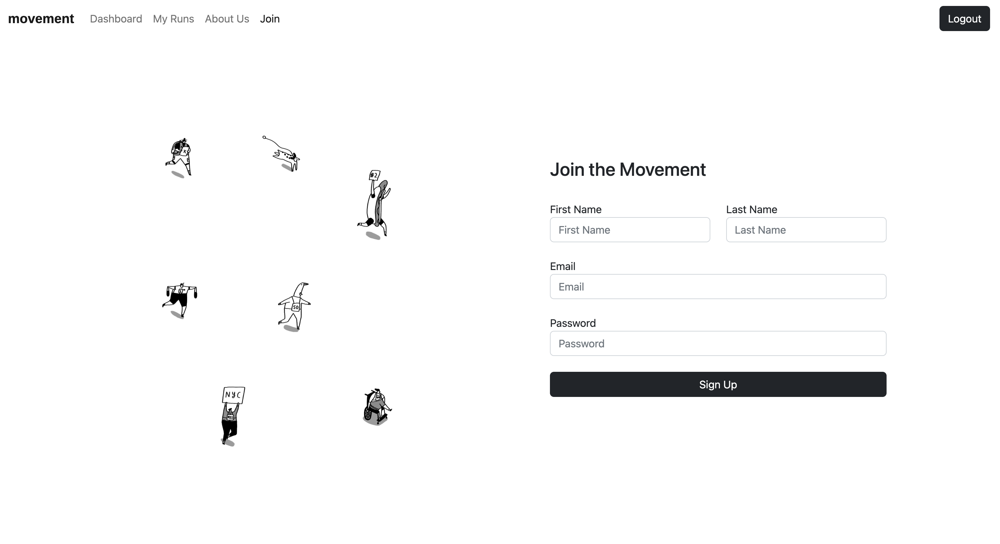
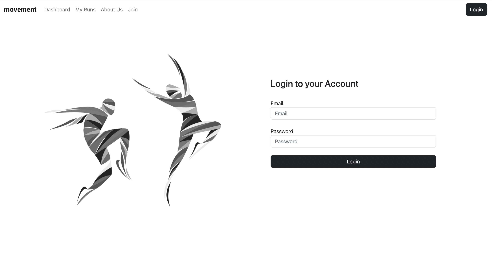
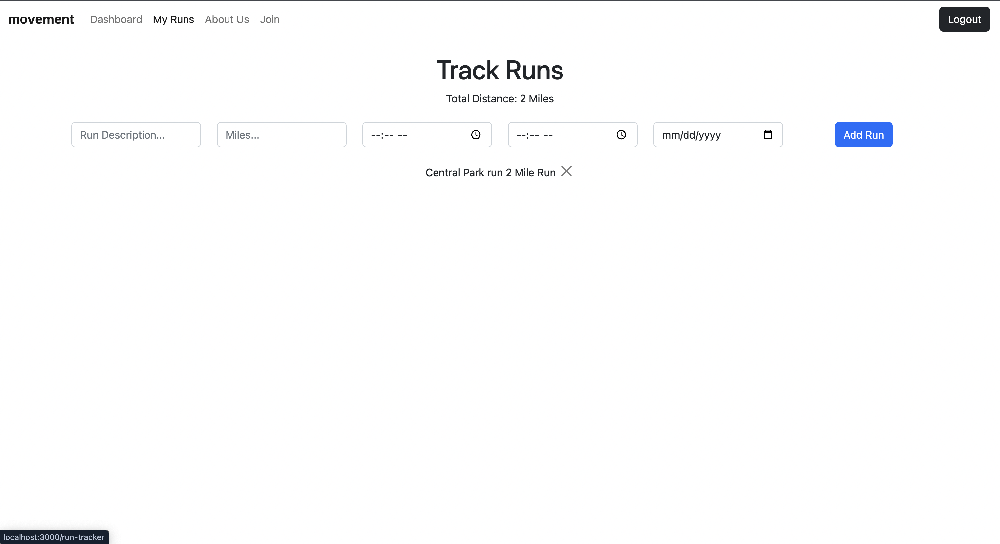
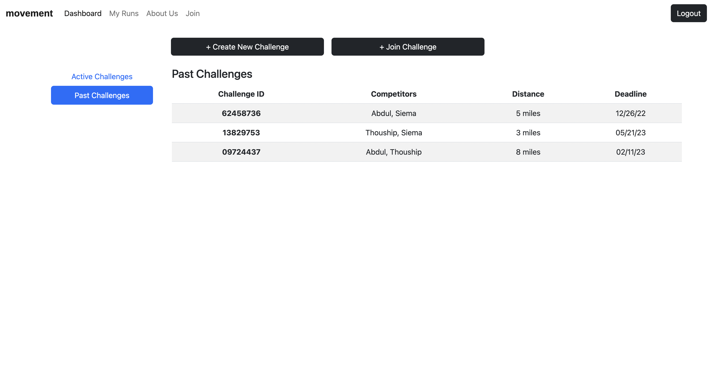
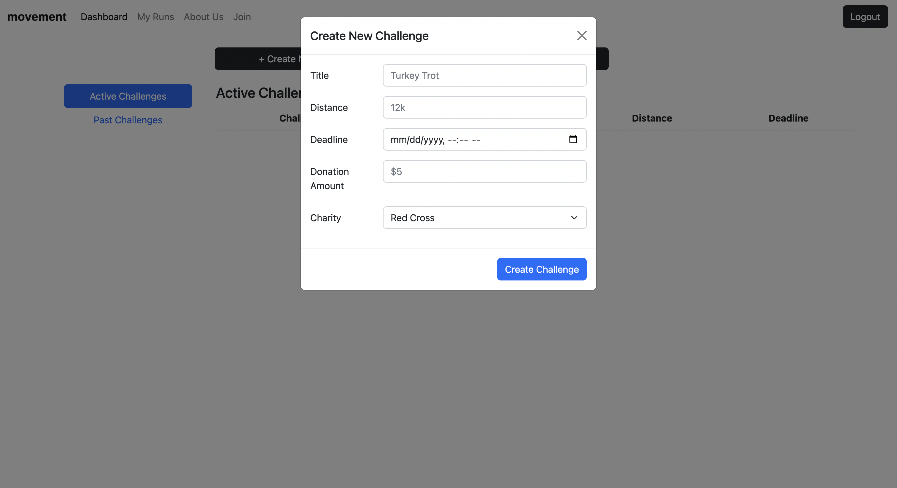
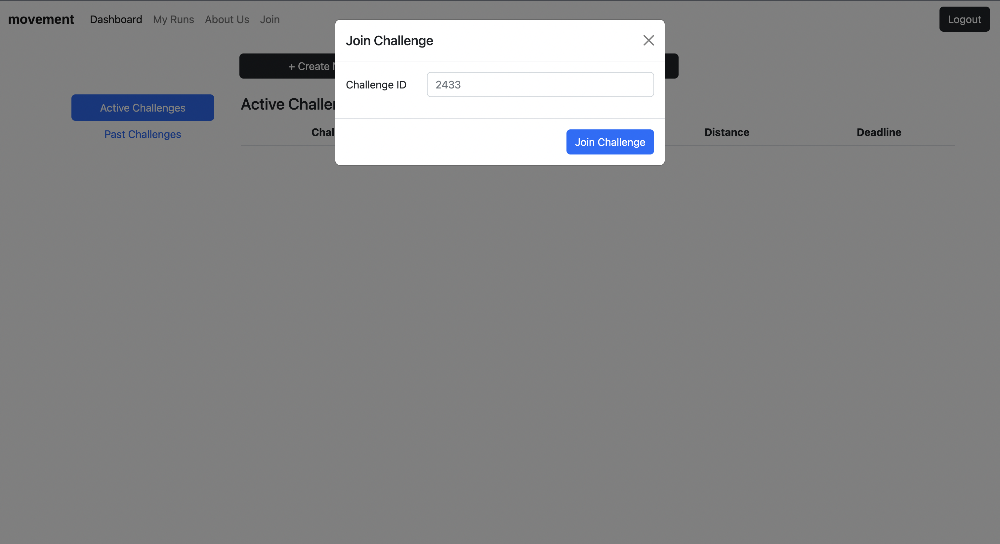
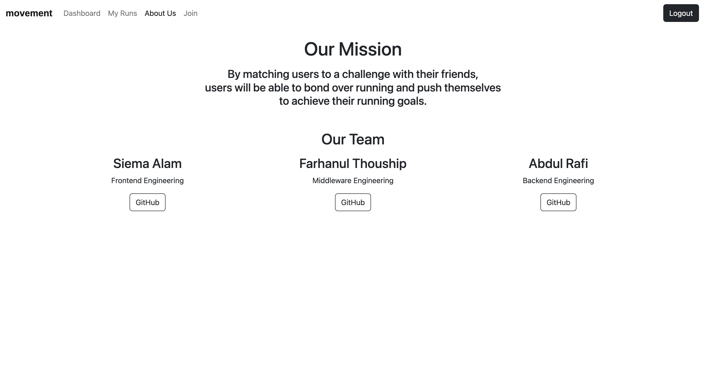

# Movement

Movement is a fitness app that lets users challenge their friends and raise money for charity. The goal is simple: create or join a fitness challenge, users compete to complete the challenge, those that fail to complete the challenge will have to donate to a charity of the winner's choice. 

## User Stories

- User can sign up 
- User can log in
- User can track their runs
- User can create a challenge
- User can join a challenge
- User can view active/past challenges

## Screenshots

#### Home Page

#### Sign Up Page

#### Log In Page

#### Track Runs Page

#### View Challenges Page

#### Create Challenge Popup

#### Join Challenge Popup

#### About Us Page

